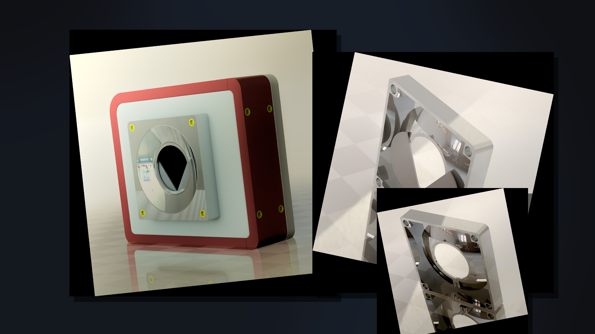
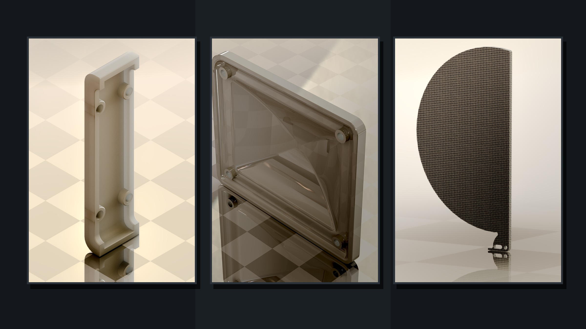

# Camera One
Camera One is my academic thesis for my time as a design major. This project brings together aspects from my former learnings, such as commercial photography, computer science, marketing, and now 2D and 3D drafting. My plans for this project are that it will grow with me as I continue on to study mechanical engineering.

This project is and experiment that I hope will one day bring together the open-source communities of hardware, software, and electrical device creators. My goal is to create a medium-format camera that can support film or digital backs 4"x5" or smaller but not be held to those limitations. Currently I am working on designing the camera platform design, but will soon begin work on designing a shutter and lens mounting system, as well as a 35mm film advancement mechanism. I look forward to your support!

# Goals
## The Initial Design  
The initial v1.0 release milestone will mark the completion of several key conditions. Camera One v1.0 will be a functional 35mm film camera with M42 lens mounting system and pneumatically driven bulb and/or time shutter based on the Packard design.

# How The Project Works
Currently this project is being developed in Solidworks using STereoLithography files for GitHub support and feature tracking.

To contribute to this project just edit the Solidworks part files (.SLDPRT) save that file to .SLDPRT, .STL and .3MF and submit. As always thank you for contributing!

# Promotional Renderings
These renderings are prepared for promotional materials and can be found in `Branding/Marketing`.

#Donations
I am now accepting donations in the for of Bitcoin in order to raise money to begin prototyping and to fuel my caffeine addiction.

##Donate with      Address: 1Ar2b5XdxwueiUwSmsCJUGcsfHGLsdctYV
